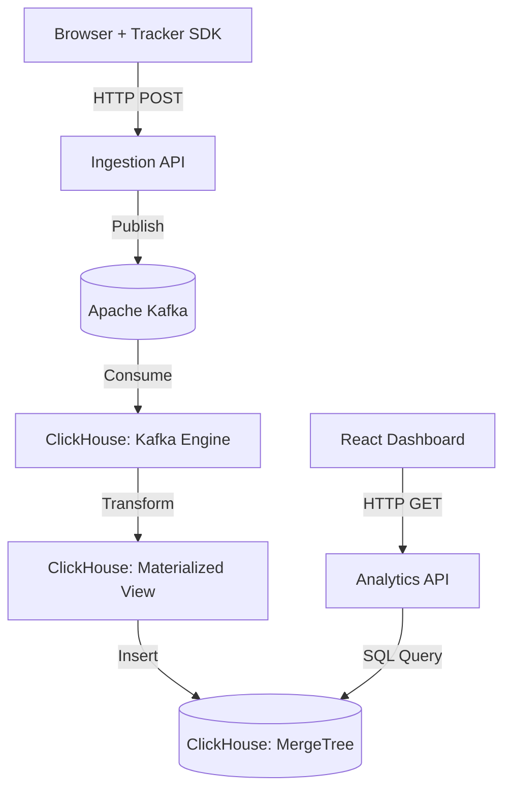

# Architecture: PulseAnalytics MVP

## System Overview
PulseAnalytics is designed as a high-throughput, real-time web analytics platform. The MVP architecture focuses on scalability and low latency, utilizing an event-driven data pipeline to handle massive amounts of incoming analytical data.

## Core Components

1. **Tracker SDK (Frontend)**
   - **Tech:** Vanilla JavaScript.
   - **Role:** Embedded in client websites. Captures user interactions (pageviews, clicks) and transmits them to the Ingestion API.

2. **Ingestion API (Backend Edge)**
   - **Tech:** Node.js + TypeScript (Fastify/Express).
   - **Role:** High-throughput endpoint that receives HTTP payloads from the Tracker SDK, validates them, and acts as a Kafka Producer to queue the events.

3. **Message Broker (Streaming)**
   - **Tech:** Apache Kafka.
   - **Role:** Buffers incoming events to decouple ingestion from processing, ensuring high availability and safe handling of traffic spikes.

4. **OLAP Database (Processing & Storage)**
   - **Tech:** ClickHouse.
   - **Role:** The core analytical engine. It utilizes a `Kafka Engine` table to consume events directly from the Kafka topic. A `Materialized View` then transforms these events in real-time and inserts them into a `MergeTree` table for blazing-fast aggregations.

5. **Analytics API (Backend Queries)**
   - **Tech:** Node.js + TypeScript.
   - **Role:** Serves as the backend for the Dashboard, executing analytical OLAP queries against ClickHouse and returning JSON responses.

6. **Dashboard (Frontend)**
   - **Tech:** React + Vite.
   - **Role:** Admin UI for visualizing real-time metrics and charts.

## Data Pipeline Flow

